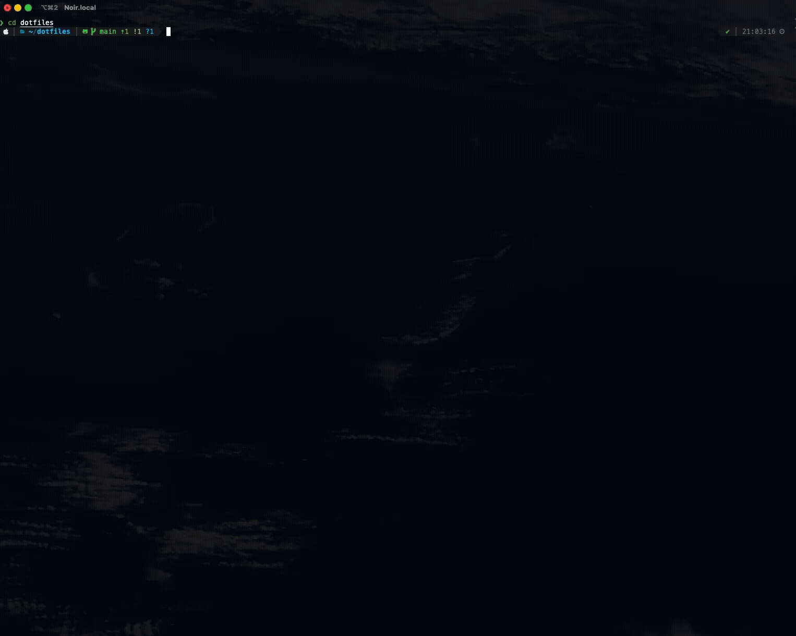

# dotfiles

These dotfiles are built for day-to-day development, centered around Neovim, tmux, and zsh.
The setup is designed to balance visual polish with practical speed, while staying easy to reproduce with minimal steps.



## Preview

- Shell: `zsh` + `oh-my-zsh` + `powerlevel10k`
- Editor: `neovim` + `lazy.nvim` + LSP + DAP
- Terminal multiplexer: `tmux`
- Dashboard animation: `terminaltexteffects (tte)` + `logo.txt`

```text
dashboard preview source: ./logo.txt
```

## Why This Repo

- A complete Neovim setup including LSP, completion, and DAP
- Startup UX with `dashboard.nvim`, including animated preview effects
- Git workflow powered by `lazygit` + `delta`
- Dependencies split into Required and Optional groups for gradual adoption

## Requirements

### Required

- [git](https://git-scm.com/)
- [iTerm2](https://iterm2.com/) (manual install)
- [neovim](https://neovim.io/)
- [Node.js](https://nodejs.org/) (`nvim-dap` php adapter / `copilot.lua`)
- [oh-my-zsh](https://ohmyz.sh/)
- [ripgrep](https://github.com/BurntSushi/ripgrep) (`fzf-lua` `live_grep`)
- [fzf](https://github.com/junegunn/fzf)
- [lazygit](https://github.com/jesseduffield/lazygit)
- [delta](https://github.com/dandavison/delta)
- [tmux](https://github.com/tmux/tmux)
- [zsh](https://www.zsh.org/)

### Optional (Shell / Git UX)

- [docker](https://www.docker.com/) (manual install)
- [powerlevel10k](https://github.com/romkatv/powerlevel10k) (manual install)

### Optional (Neovim Feature Dependencies)

- [terminaltexteffects (tte)](https://github.com/ChrisBuilds/terminaltexteffects) (`dashboard.nvim` preview)

## Install

This guide uses `$HOME/dotfiles` as an example path (the installer works from any clone location).

```zsh
git clone https://github.com/noir4y/dotfiles.git
cd ~/dotfiles
./install.sh
```

To install required dependencies at the same time (macOS + Homebrew):

```zsh
./install.sh --deps
```

Packages installed with `--deps`: `git`, `neovim`, `tmux`, `zsh`, `ripgrep`, `node`, `fzf`, `lazygit`, `delta`
(`iTerm2` is required but must be installed manually)

To include optional dependencies as well:

```zsh
./install.sh --optional
```

Additional packages installed with `--optional`: none (only manual-install tools remain optional)
(`docker` / `powerlevel10k` must be installed manually)

`install.sh` creates links for:

- `~/.zshrc`
- `~/.p10k.zsh`
- `~/.tmux.conf`
- `~/.config/nvim`

Existing files are backed up by default. You can also run the linking commands manually if needed.

```zsh
BACKUP_DIR="$HOME/.dotfiles_backup_$(date +%Y%m%d_%H%M%S)"
mkdir -p "$BACKUP_DIR" "$HOME/.config"

[ -e "$HOME/.zshrc" ] || [ -L "$HOME/.zshrc" ] && mv "$HOME/.zshrc" "$BACKUP_DIR/.zshrc"
[ -e "$HOME/.p10k.zsh" ] || [ -L "$HOME/.p10k.zsh" ] && mv "$HOME/.p10k.zsh" "$BACKUP_DIR/.p10k.zsh"
[ -e "$HOME/.tmux.conf" ] || [ -L "$HOME/.tmux.conf" ] && mv "$HOME/.tmux.conf" "$BACKUP_DIR/.tmux.conf"
[ -e "$HOME/.config/nvim" ] || [ -L "$HOME/.config/nvim" ] && mv "$HOME/.config/nvim" "$BACKUP_DIR/nvim"

ln -sfn ~/dotfiles/zshrc ~/.zshrc
ln -sfn ~/dotfiles/p10k.zsh ~/.p10k.zsh
ln -sfn ~/dotfiles/tmux.conf ~/.tmux.conf
ln -sfn ~/dotfiles/nvim ~/.config/nvim
```

Options:

- `./install.sh --dry-run` (preview changes)
- `./install.sh --force` (replace without backup)
- `./install.sh --deps` (install required dependencies via Homebrew)
- `./install.sh --optional` (install optional dependencies via Homebrew)

## First Launch

1. Import `~/dotfiles/iterm.json` in iTerm2 (`Settings > Profiles > Other Actions... > Import JSON Profiles...`).
2. (Optional) Install `terminaltexteffects (tte)` if you want animated dashboard logo output.
3. Launch `nvim` to trigger automatic plugin installation.
4. Open `:Mason` and verify the language servers / formatters you need.
5. Start `tmux` and confirm keybindings.
6. Launch `lazygit` and check `delta` integration output.

## Key Workflows

- Files: `<leader>f`
- Grep: `<leader>g`
- Buffers: `<leader>b`
- Git status picker: `<leader>e`
- File tree toggle: `<leader>ft`
- Window resize mode: `<leader>w`
- DAP: `<F1>`..`<F5>`, `<F9>`, `<F10>`

## Repository Layout

- `zshrc`: zsh / oh-my-zsh / alias / fzf
- `tmux.conf`: tmux keybind and pane behavior
- `lazygit.yml`: lazygit + delta settings
- `nvim/`: Neovim config (plugins, keymaps, LSP, DAP, dashboard)
- `logo.txt`: dashboard preview source for `tte`

## License

[MIT](./LICENSE)
